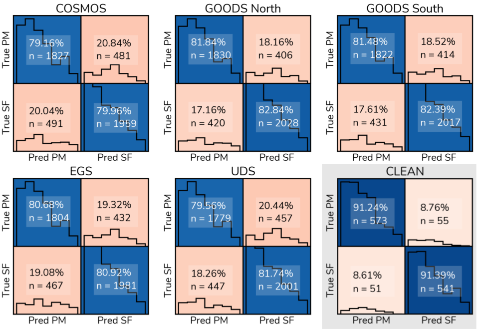

# A Simulation Driven Deep Learning Approach for Separating Mergers and Star Forming Galaxies
Leonardo Ferreira, Christopher Conselice, Ulrike Kuchner and Clar-Bríd Tohill


Repository with all Keras/Tensorflow pre-trained models to separate Postmergers from Star Forming galaxies from Ferreira et al. 2022.

## Models

### Classification

As described in the paper, each CANDELS field has two models associated with it. One for ACS imaging, covering redshifts 0.5 < z < 1.5 and a second one for 1.5 < z < 3.0 for WFC3. Training was done in these two segments especially due the different resolution of the images, 0.03"/pix and 0.06", respectively.

Trained models can be easily loaded with

```python
from metrics import Upsilon
from tensorflow.keras.models import load_model

COSMOS = load_model('models/F814W/COSMOS/', custom_objects = { 'Upsilon' : Upsilon })

COSMOS.predict(X)...
```

The ```Upsilon``` class is a custom metric that was used during training and is a requirement for the model's unserialization. It represents the minimum value of the diagonal of the confusion matrix, i.e the lowest precision among classes. We found that this metric is more realistic and is not misleading in case of disparity between classes. If the precision between classes is [0.99, 0.5], Upsilon=0.5. However, this is irrelevant for the direct usage of these models and only necessary for the ```load_model``` function.

All models use the ```MonteCarloDropout``` layer (present in ```models.py```), and the predictions will vary every time. We advise that these models shoud be used to produce probability distributions instead of just a single prediction for each image.

### Contamination
The contamination regression models are based on the same structure, but with a different top dedicated for regression. These models will be released in the following days. For a demo access: http://intra.astroferreira.com/contamination

## Metrics


## Code
Our model is simple to reproduce in any framework, but we release the definition of the keras model in ```models.py```. Training, dataset augmentation, and optmization scripts will be release in the next few days.

## Data

Our data consists of a large number of RT simulated IllustrisTNG100 galaxies (with SKIRT) that are then CANDELIZED to include realistic observational properties. These datasets are huge and can't be easily served through Github (~160,000 128x128 single band images). The ready to train data is stored in TFRecords files that are handled by a custom data pipeline built with ```tf.data```. We can share these data upon reasonable request.
